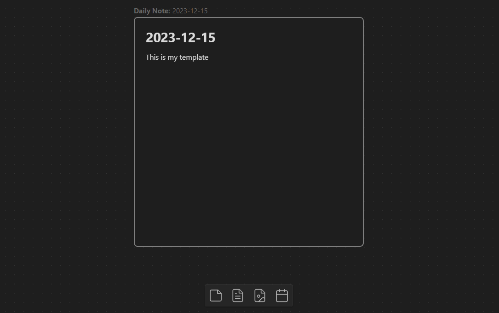
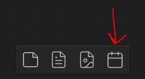
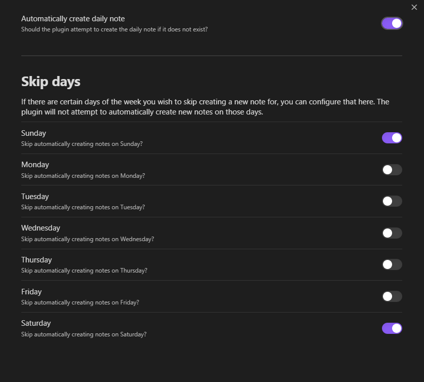

# Obsidian Canvas Daily Note

A plugin for Obsidian.MD that allows you to add a daily note node to the canvas that will always show todays note.



## How to Install

Plugin will be added to official repository shortly.

## How to Use

On a canvas view, a new button will be added. When you click this button, it will add a new file node for your daily note. The plugin will automatically keep this file node up to date with the latest daily note whenever you open the canvas.



> [!NOTE]
> This plugin works by adding a special metadata (`unknownData`) to the file node. It will only work on these nodes crated via the plugin and will not work on existing file nodes.

> [!WARNING]
> The updating of the daily note to today's note involved removing the existing canvas node and replacing it with a new one. As a result, the plugin currently doesn't support connections from the daily note node to other nodes.

## Settings

When inserting a new node, or updating en existing node to today's daily note, the plugin by default will create the daily note if it does not already exist.

If you would like the plugin to not do this, or not do it on specific days of the week, you can update this in settings.



## Customization

To customize the appearance of a daily note node, you can utilize CSS to target the element.

```css
/* Change look of Button */
.canvas-button-adddailynote {
}
/* Change look of daily note node */
.canvas-node-dailynote {
}
/* Change look of daily note node label */
.canvas-node-dailynote .canvas-node-label {
}
/* Change look of daily note node label pre-text */
.canvas-node-dailynote .canvas-node-label:before {
}
```

## Reporting Issues

If you run into any issues with this plugin, please [open an issue](https://github.com/andrewmcgivery/obsidian-ribbon-divider/issues/new) and incude as much detail as possible, including screenshots.
